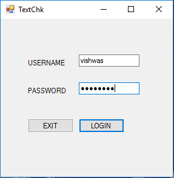
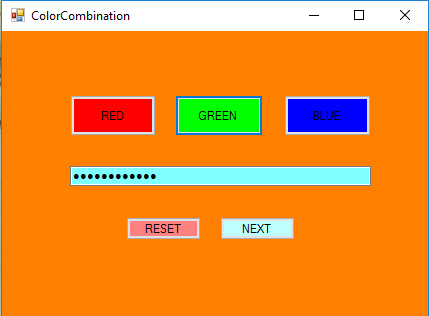
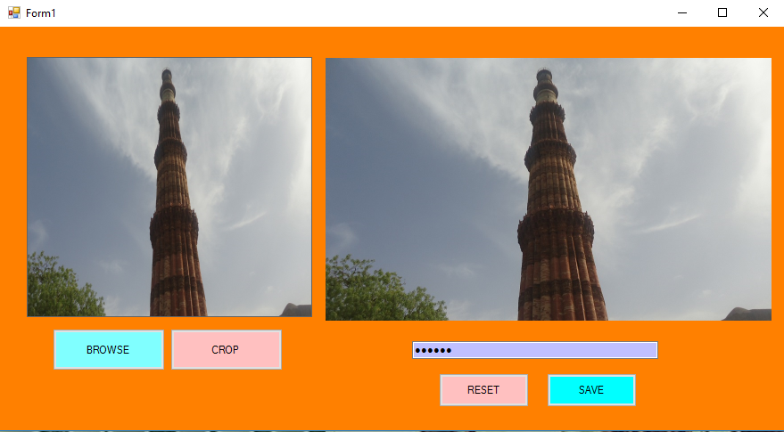

# **Three Level Password Authentication System.**
_This project is made to implement three levels of passwords for mainly windows folders to simply secure windows folders. So that no one can read or write on that folder directly without entering the password or simply without unloacking the folder._

## This system have three levels of passwords showen bellow:

### Level 1 Text Password
_For text password it is a simple text based password to pass the level 1._

### Level 2 Color Combination
_For Color Combination password there is basically three colors red green blue(RGB) where user can set different combination of colors by clicking on those colors._

### Level 3 Picture Password
_For Picture Password there at first user have to select an image in jpg format to use as an password and then user can set the password by clicking on the image in different places, at the time of login the user have to choose the same picture he have choosen to take as an password and then user have to click at the same places where he/she have clicked at the time of setting the password._

### Then a folder locking system:
_This is a simple folder locking system which user can operate just by browsing the folder he/she wants to lock then user can simply click lock to lock the folder or unlock to unlock the folder._

## Advantages of this Application
- This application provides the aditional security to the windows folders.
- This application have an easy to use interface for interacting with this application.
- It provides aditional security from the keyloggers because the keylogger can only work in the case of text password but there are two more passwords which are color combination and picture password.
- It provides security to folders so that without unlocking the folder no one can delete, read, write, move or copy the folder.

## For Debugging or making modifications and contribution 
- Please download the Visual Studio and then run the visual studio as an administrator.
 
- Open the project folder in Visual Studio.
- Then set the debugger for TLPAS.csproj file.
 
- Create an sql database connection with the provided data.mdf file locatied in bin/Debug/data.mdf
- Then open the main.cs file and change the line 53 and set the location of your database and thats it all done.
 
-This project is not completely portable yet because everytime if we share it someone else then a new database is needed to be created and some code is to me modified so if anyone finds a solution for that then please contribute to my GitHub repo.

----
